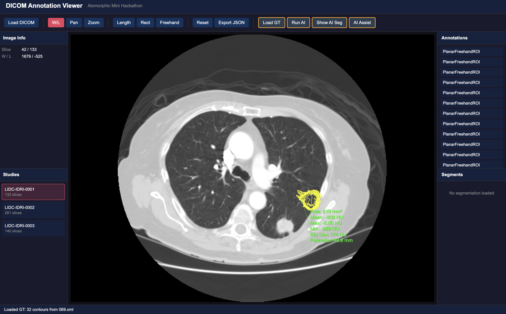
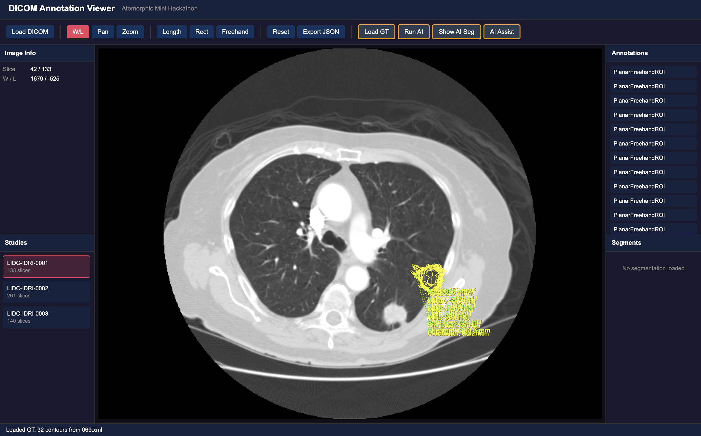

# Hackathon Report — [Your Name]

**Date:** 24 February 2026  
**Coding:** 16:00–18:00  
**Report writing:** 18:00–18:30  
**Tasks completed:** *(e.g. Task 1, Task 2, partial Task 3)*

---

## Overview

*What did you build? What was your overall strategy? (3–5 sentences)*

---

## Tasks

For each task you attempted, briefly describe what you did, what surprised you, and any tradeoffs you made. Skip tasks you did not attempt — or leave a one-line note on why.

### Task 1 — Study Selector

I expected this segment to take the least time, so I wrote a prompt to be as detailed as possible so that I could quickly move on to the next task.

This was my prompt:   
`currently, images are loaded manually via the load DICOM button, where the user manually goes into the data/[LIDC ID]/ct files and selects all dicom files. We want to change this, such that we list the 3 LIDC studies as labels in the left panel; clicking one goes into the ct folder and loads its CT slices into the viewer automatically.

we can do this by: 
use const LIDC_STUDIES and loadStudy are exported from ./core/loader — both are already imported in App.tsx
The JSX placeholder is already in the left panel — find Task 1: implement study selector and replace it
Use the activeStudy state (already defined) to track and highlight the selected study`

1. How did you structure the panel and manage the active study state?
The panel listed the IDs of the different folders from the LIDC_STUDIES as buttons, which loaded the images. 
2. What edge cases did you consider (e.g. switching studies while annotations are loaded)?
The issue with this implementation was that not all images are loaded at once. They are uploaded batch by batch, sparsely. This makes scrolling somewhat spotty when not all the scans are fully loaded. 
3. If you used AI: what did it get wrong and what did you have to fix?

### Task 2 — Load Ground Truth

I started by inputing the instructions of Task 2 into the LLM:   
`Task 2 involves changing handleLoadGT, where we will need to fetch the LIDC XML for the active study, parse nodule contours, and display them as freehand overlays on the correct slices on top of the current dicom scan. 

The annotation of each patient is specified as coordinates in xml. but many many slices and image may lie on specific xyz axis, so we need to pay attention to the image z position - height, bc image will consist of several images. The xy coordinates are the contour of the module and roi is the region of interest.

The LIDC XML uses a default namespace xmlns="http://www.nih.gov" — standard getElementsByTagName will not find elements. You need namespace-aware querying: see MDN: getElementsByTagNameNS
Each <roi> has an <imageZposition> (Z in mm) and a list of <edgeMap> elements with <xCoord> / <yCoord> in image pixel coordinates
Cornerstone3D annotations use world coordinates (mm), not pixels — look at the utilities export from @cornerstonejs/core for the conversion function. Its signature is (imageId, [row, col]) — note the order: row first, then column (i.e. [yCoord, xCoord] from the LIDC <edgeMap>)
To add annotations programmatically use annotation.state.addAnnotation() from @cornerstonejs/tools — see Cornerstone3D docs
scripts/parse_lidc_xml.py shows the XML structure in Python if you want to study it first.`

Immediately, we received a successful implementation, where after scrolling we could find the annotation:   

I identified two bugs with the AI's implementation:
1. In the Annotations panel, Planar Freehand ROI entries don’t provide any actionable controls — the panel currently just lists each ROI without additional functionality.
2. Selecting multiple annotations causes their comments/statistics panels to overlap, and the thin ROI outlines make it hard to click/deselect a specific annotation. (see below).  

While fixing issue 2, the annotations intermittently disappeared as I added more logic for slice navigation and overlay behavior. To recover, I rolled back to the last stable implementation and reintroduced changes incrementally:

1. Compute the first CT slice that contains at least one ROI annotation.
2. Compute the slice with the strongest ROI signal (highest contour concentration).
3. Add jump-to-slice behavior targeting the highest-ROI slice.
4. Improve visual rendering by increasing ROI line contrast/thickness and fixing overlay layering.

Fix 4 stabilized visibility, and the current behavior now jumps to the CT slice with the highest ROI concentration.

### Task 3 — Run AI Segmentation

### Task 4 — Display AI Segmentation

### Bonus

---

## Reflection

*Answer any or all of the questions below — or raise your own.*

- What was the hardest part of the challenge?
- What would you do differently if you had more time?
- Was there anything about the codebase or tooling that surprised you?

---

## AI Usage

*Which tools did you use, and how did you use them? What did you have to verify or correct?*
